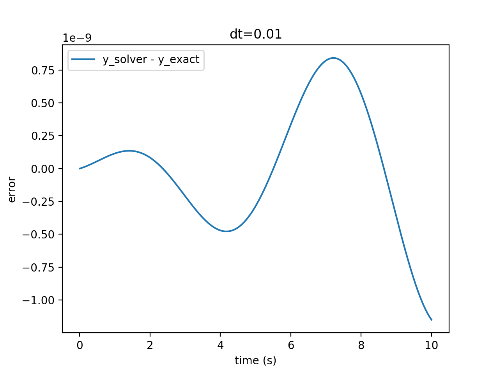

# Runge-Kutta Solver for Equations of Motion

Solver for explicit second order ODEs, e.g. mechanical equations of motion.

## Description
Since equations of motion are (mostly) explicit 2nd order ODEs, the classical Runge-Kutta method can't be applied.
Instead, second order ODEs can be reduced to first order ODEs to the cost of doubling the number of equations. Then, the Runge-Kutta can be applied to these systems of first order ODE.

## Test
Consider the [harmonic oscillator](https://en.wikipedia.org/wiki/Harmonic_oscillator#Simple_harmonic_oscillator) with unit eigenfrequency and initial values y(0) = 1, y'(0)=-1. The error is shown in the figure below.

